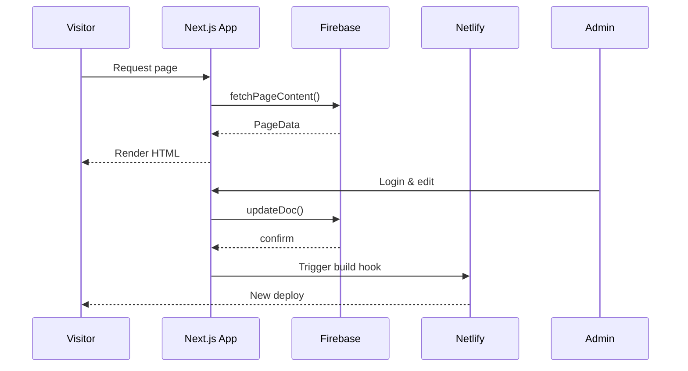
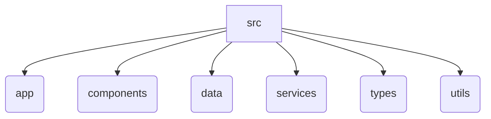

# Alabama Hands & Voices Website

This repository contains the source code for the **Alabama Hands & Voices** website. The site is built with [Next.js](https://nextjs.org/), TypeScript and Tailwind CSS. Content is managed in [Firebase](https://firebase.google.com/) and deployed via [Netlify](https://www.netlify.com/).

## Features

- **Next.js App Router** with dynamic routes under `src/app`.
- **Tailwind CSS** with custom color palette (`hvblue` and `hvorange`) and local fonts.
- **Firebase Firestore** for storing page sections and other content.
- **Firebase Authentication** protecting the `/admin` interface for editing pages.
- **Netlify build hook** triggered after admin updates to redeploy the static site.
- Rich component library in `src/components` using Headless UI.

## Development

### Prerequisites

- Node.js 18+
- npm or yarn
- Firebase project credentials

### Environment variables

Create a `.env.local` file at the project root and provide your Firebase credentials:

```bash
NEXT_PUBLIC_FIREBASE_API_KEY=your-key
NEXT_PUBLIC_FIREBASE_AUTH_DOMAIN=your-domain
NEXT_PUBLIC_FIREBASE_PROJECT_ID=your-id
NEXT_PUBLIC_FIREBASE_STORAGE_BUCKET=your-bucket
NEXT_PUBLIC_FIREBASE_MESSAGING_SENDER_ID=your-sender-id
NEXT_PUBLIC_FIREBASE_APP_ID=your-app-id
```

### Install dependencies

```bash
npm install
```

### Start the development server

```bash
npm run dev
```

Visit <http://localhost:3000> to view the site.

## Building

To create a production build:

```bash
npm run build
```

## Deployment

The project is designed for Netlify. A build hook is triggered from the admin panel after saving content. You can also deploy manually by pushing to the main branch or running:

```bash
npm run build && npm run start
```

## Project Structure

```text
src/
  app/            # Next.js routes
  components/     # Reusable UI and page components
  data/           # Static data (e.g. board members)
  services/       # Firebase utilities
  types/          # Shared TypeScript types
  utils/          # Helper utilities
```

## Data Flow

The following diagram illustrates how content is fetched and updated.



## Folder Overview



## License

This project is maintained by Alabama Hands & Voices. All rights reserved.

