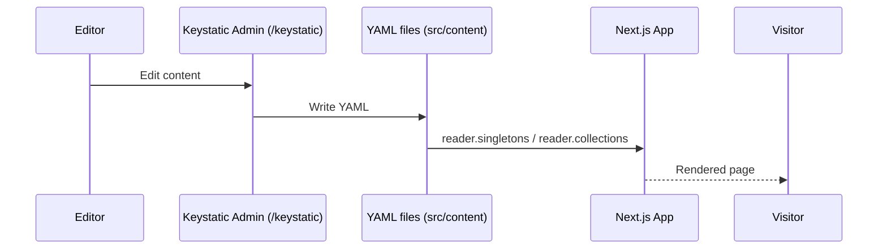

# Alabama Hands & Voices Website

This repository contains the source code for the **Alabama Hands & Voices** website. The site is built with [Next.js](https://nextjs.org/) (App Router), TypeScript and Tailwind CSS. Content is managed with [Keystatic](https://keystatic.com/) and the site is deployed via [Netlify](https://www.netlify.com/).

## Features

- **Next.js 16 App Router** with React 19 — pages are async server components.
- **Keystatic CMS** in local-file storage mode: content lives as YAML files in `src/content/` and is edited through the admin UI at `/keystatic`.
- **Tailwind CSS** with custom brand palette (`hvblue` #141B4B, `hvorange` #FF7F32) and the Kaushan Script decorative font.
- **Netlify Forms** for contact/membership form submissions.
- Component library in `src/components` using Headless UI and Framer Motion.

## Development

### Prerequisites

- Node.js 18+
- npm

No environment variables are required for local development.

### Install and run

```bash
npm install
npm run dev
```

Visit <http://localhost:3000> to view the site, and <http://localhost:3000/keystatic> to open the content editor.

### Other commands

```bash
npm run build    # Production build
npm run start    # Serve the production build
npm run lint     # ESLint
```

## Content Management

Content schemas are defined in `keystatic.config.ts`:

- **Singletons** — one YAML file per page (home, about, contact, membership, programs, resources, FAQ) plus global site settings and navigation, in `src/content/singletons/`.
- **Collections** — board members, staff members, and videos, one YAML file per entry in `src/content/`.

Editing content in the `/keystatic` admin writes directly to these YAML files, so content changes appear as normal git diffs and deploy with the next push.

Server-side reader helpers live in `src/lib/keystatic/` (`pages.ts` for singletons, `collections.ts` for collections). These are server-only and must not be imported from client components.

## Project Structure

```text
src/
  app/              # Next.js routes (public pages, /keystatic admin, API)
  components/       # Layout, page-specific, and UI components
  content/          # Keystatic-managed YAML content
  lib/keystatic/    # Server-only content reader helpers
  types/            # Shared TypeScript types
  utils/            # Helpers (e.g. Netlify form submission)
```

## Data Flow


```mermaid
sequenceDiagram
    participant Editor
    participant Keystatic as Keystatic Admin (/keystatic)
    participant Repo as YAML files (src/content)
    participant NextJS as Next.js App
    participant Visitor

    Editor->>Keystatic: Edit content
    Keystatic->>Repo: Write YAML
    Repo->>NextJS: reader.singletons / reader.collections
    NextJS-->>Visitor: Rendered page
```

## Deployment

The site deploys to Netlify on pushes to `main`. The build command is `npm run build`; `next.config.mjs` includes `outputFileTracingIncludes` so the `src/content/` YAML files are bundled with the deployed app.

The production content-editing mode (Keystatic GitHub mode, Keystatic Cloud, or local-only editing) is still an open decision — see `plans/keystatic-next-upgrade-plan.md`.

## License

This project is maintained by Alabama Hands & Voices. All rights reserved.
